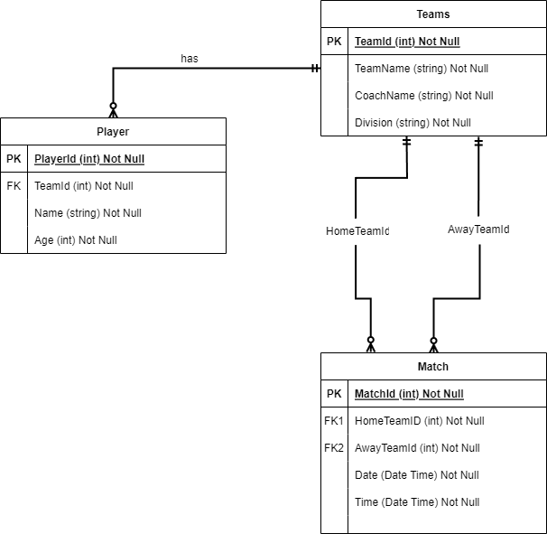

# GPFC Management System Documentation

## Derik Mahan - CIDM 3312

## Project Overview
The GPFC Management System is designed for the Gregory Portland Futbal Club to manage teams, players, and matches efficiently. This application utilizes ASP.NET Core with Entity Framework Core and supports key functions such as match overview, team management, and player registration tailored to the club's needs.

## Entity-Relationship Diagram (ERD)
### Entities and Their Attributes
#### Team
- **TeamId** (int): A unique identifier for each team.
- **TeamName** (string): The name of the team.
- **CoachName** (string): The name of the team coach.
- **Division** (string): Team’s division (U6, U8, U10, U12).

#### Player
- **PlayerId** (int): A unique identifier for each player.
- **Name** (string): The player’s full name.
- **Age** (int): The player’s age.
- **TeamId** (int FK): Foreign key linking to the Team entity.

#### Match
- **MatchId** (int): A unique identifier for each match.
- **Date** (DateTime): The date when the match is scheduled.
- **Time** (DateTime): The specific time when the match will start.
- **HomeTeamId** (int FK): Foreign key linking to the Team entity (home team).
- **AwayTeamId** (int FK): Foreign key linking to the Team entity (away team).

### Relationships
- Teams have multiple Players (One-to-Many)
- Matches involve two Teams (Many-to-One)

## Functionality
- **Match Overview:** View all upcoming matches showing involved teams.
- **Team Management:** View team details including a list of players.
- **Player Directory:** List all players showing their associated team.

## Business Rules
### Teams and Players
- Each team must have a unique name and coach.
- Teams consist of multiple players, but each player can belong to only one team at a time.
- Players must have a name and age.
- Players must be correctly aged for their division; e.g., U6 for players under 6 years.

### Matches
- Matches are scheduled between two distinct teams and must have a predefined date and time.

## Implementation Notes
- **Data Integrity:** Ensure all data entries adhere to defined formats and constraints (no negative ages, valid team associations).
- **User Interface:** Scaffold basic CRUD operations for Teams, Players, and Matches. Extend as project scope allows.
- **Enhanced Features:** Implement paging and sorting for player listings due to potentially large data volume.

## Entity-Relationship Diagram (ERD)
